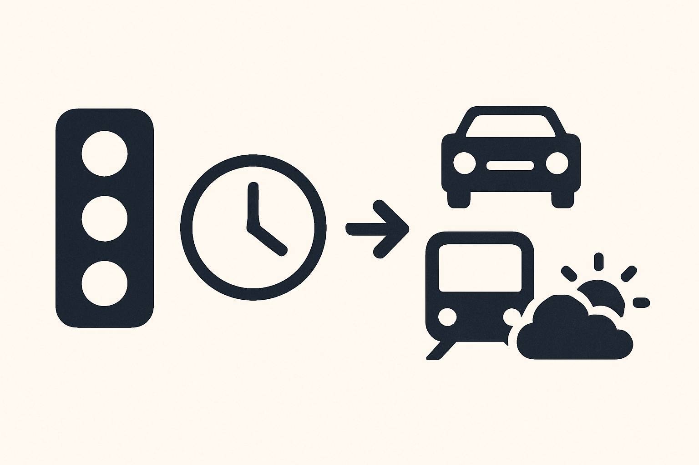

# SchedSense.ai 📅

SchedSense.ai is an AI-powered scheduling platform that leverages natural language processing to help users efficiently create and manage their schedules. The platform simplifies calendar management, meeting planning, and task organization, all through a conversational AI interface.

## Features

- 🤖 **AI-Powered Scheduling**: Interact with an intelligent assistant that understands natural language requests for scheduling events.
- 📝 **Event Management**: Create, edit, and delete calendar events with simple conversations.
- 🔄 **Google Calendar Integration**: Seamlessly syncs with Google Calendar for real-time schedule updates.
- 🌐 **Multi-User Scheduling**: Coordinate meetings across different users' availability.
- 📱 **Responsive Design**: Access from any device with a fully responsive interface.

## Tech Stack

### Frontend
- **React**: UI framework
- **TypeScript**: Type-safe JavaScript
- **Tailwind CSS**: Utility-first CSS framework
- **Next.js**: React framework with server-side rendering
- **Clerk**: Authentication and user management

### Backend
- **Python**: Primary backend language
- **FastAPI**: API framework
- **Google Calendar API**: For calendar integrations
- **Docker**: Containerization
- **OpenAI**: AI/ML capabilities

## Images

### Application Screenshots





## Getting Started

### Prerequisites
- Node.js v18+
- Python 3.9+
- Docker & Docker Compose
- Google Cloud Platform Account (for Calendar API)
- OpenAI API Key

### Installation

1. **Clone the repository**

```bash
git clone https://github.com/DanishVahora/SchedSense.ai.git
cd SchedSense.ai
```

2. **Set up the frontend**

```bash
cd frontend
npm install
cp .env.example .env.local
# Update the .env.local file with your environment variables
npm run dev
```

3. **Set up the backend**

```bash
cd backend
python -m venv venv
source venv/bin/activate  # On Windows: venv\Scripts\activate
pip install -r requirements.txt
cp .env.example .env
# Update the .env file with your environment variables
uvicorn app.main:app --reload
```

4. **Using Docker (Alternative)**

```bash
docker-compose up -d
```

## Contributing

We welcome contributions to SchedSense.ai! Please follow these steps:

1. Fork the repository
2. Create a feature branch: `git checkout -b feature/amazing-feature`
3. Commit your changes: `git commit -m 'Add amazing feature'`
4. Push to the branch: `git push origin feature/amazing-feature`
5. Open a Pull Request

## License

This project is licensed under the MIT License - see the [LICENSE](LICENSE) file for details.

## Acknowledgements

- OpenAI for their powerful API
- Google Calendar API for calendar integration capabilities
- All the open-source libraries that made this project possible
